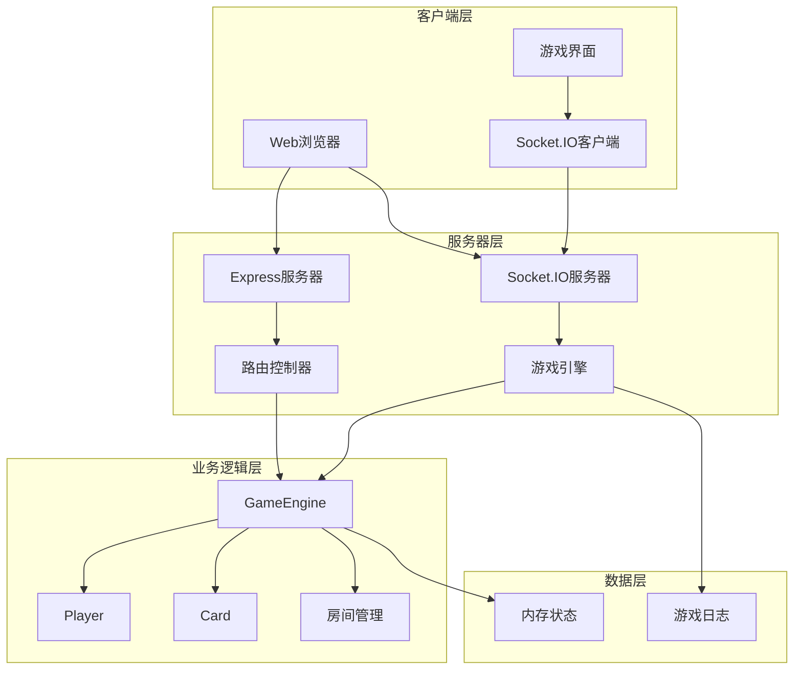
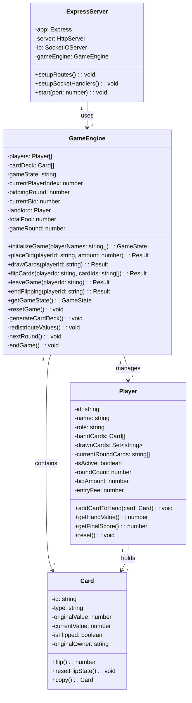
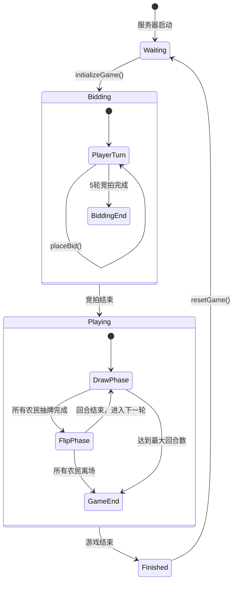
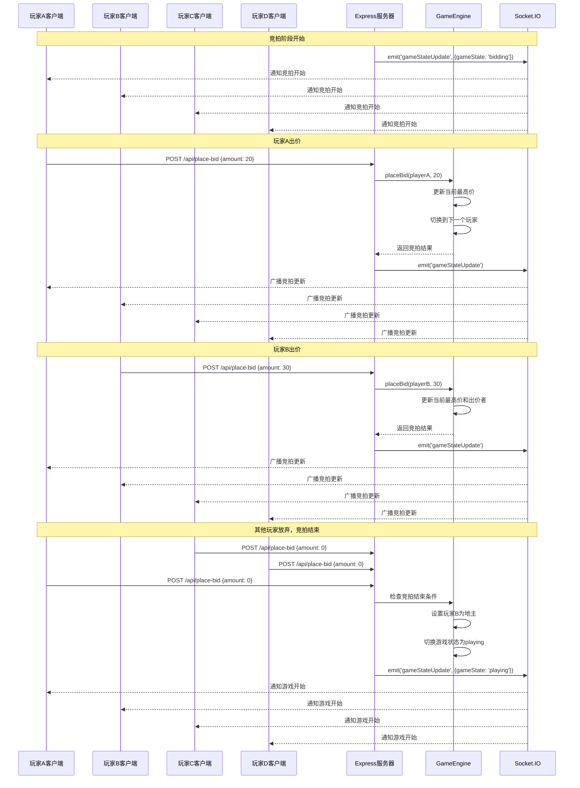
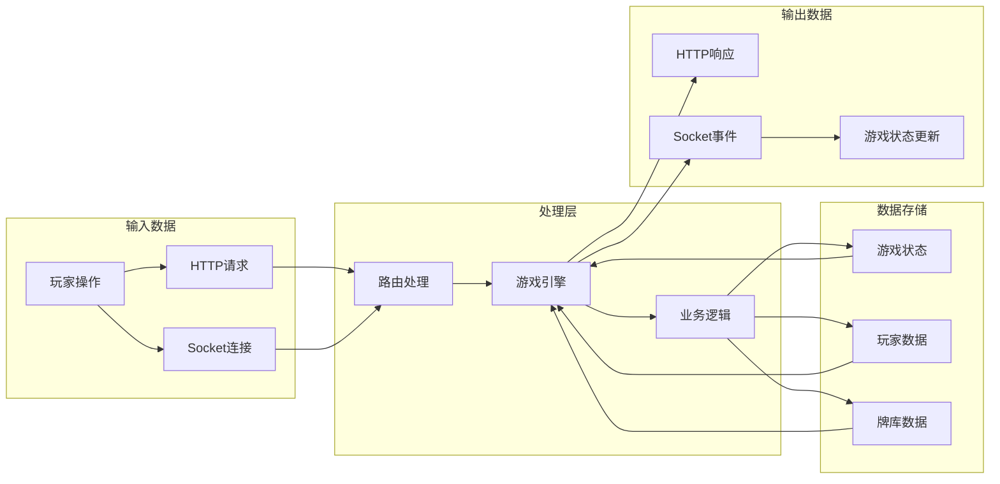
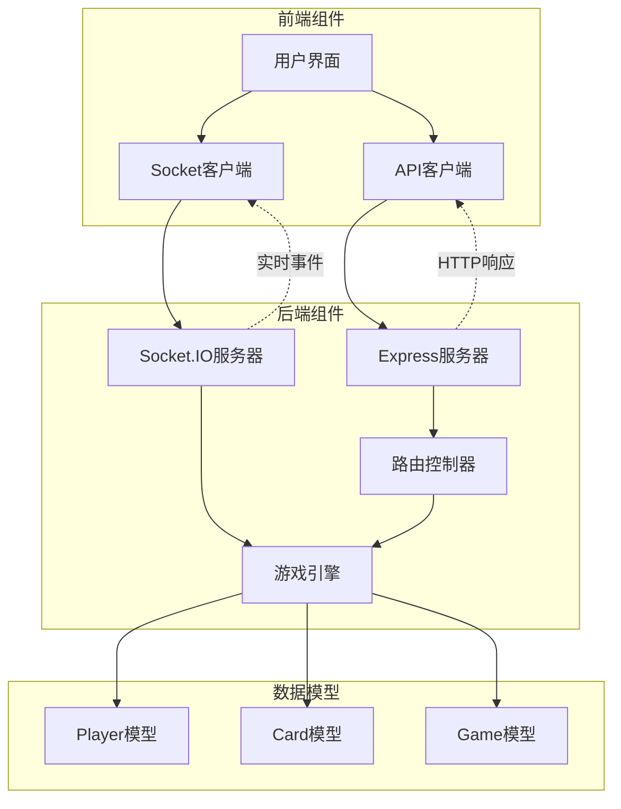
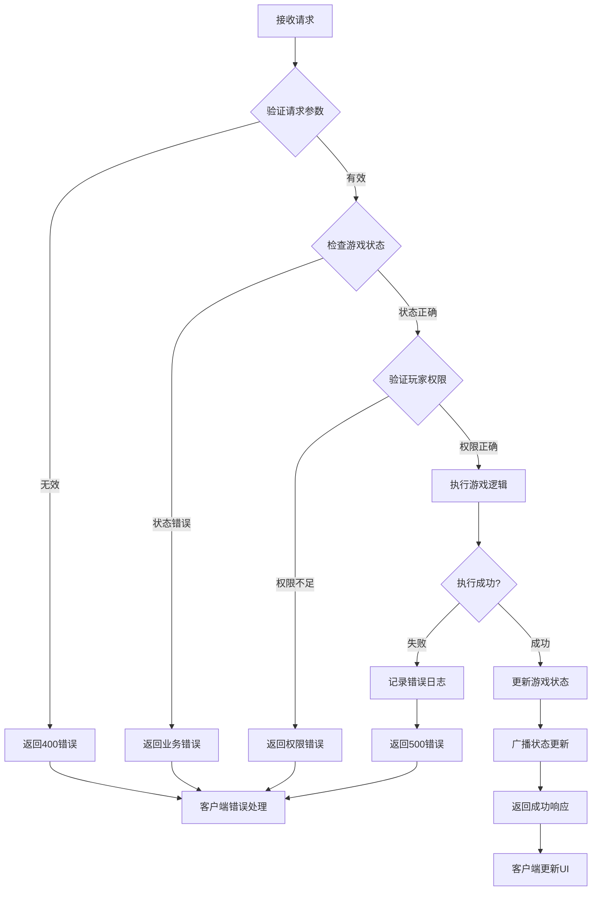
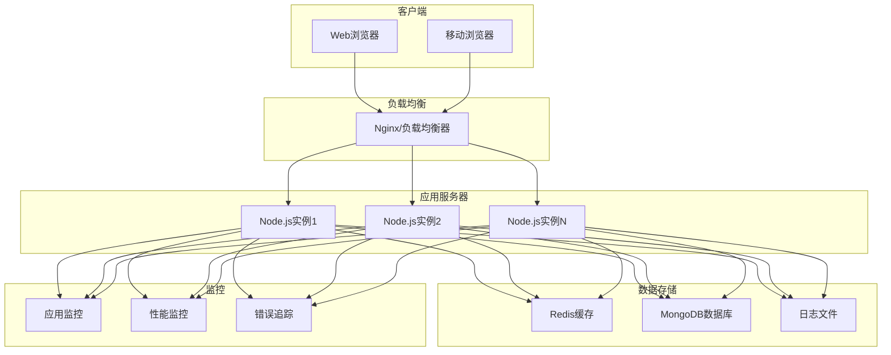

# 抽牌游戏 UML 设计图

## 1. 系统架构图



## 2. 核心类图



## 3. 游戏状态图



## 4. 抽牌翻牌时序图

```mermaid

sequenceDiagram

    participant C as 客户端

    participant S as Express服务器

    participant G as GameEngine

    participant P as Player

    participant D as CardDeck

    participant IO as Socket.IO

  

    Note over C,IO: 抽牌流程

    C->>S: POST /api/draw-cards

    S->>G: drawCards(playerId)

    G->>P: 检查玩家状态

    G->>D: 获取可用牌池

    D-->>G: 返回可抽牌列表

    G->>G: 随机选择5张牌

    G->>P: 记录抽牌历史

    G-->>S: 返回抽牌结果

    S-->>C: 响应抽牌成功

    S->>IO: emit('gameStateUpdate')

    IO-->>C: 广播游戏状态更新

  

    Note over C,IO: 翻牌流程

    C->>S: POST /api/flip-cards

    S->>G: flipCards(playerId, cardIds)

    G->>P: 验证翻牌权限

    loop 每张选中的牌

        G->>D: 翻开指定卡牌

        D-->>G: 返回卡牌类型和价值

        alt 价值牌

            G->>P: 添加到手牌

        else 炸弹牌

            G->>P: 设置玩家离场

            break 停止翻牌

        end

    end

    G->>G: 检查游戏结束条件

    G-->>S: 返回翻牌结果

    S-->>C: 响应翻牌结果

    S->>IO: emit('cardsFlipped')

    IO-->>C: 广播翻牌事件

```

## 5. 竞拍流程时序图



## 6. 数据流图



## 7. 组件交互图



## 8. 错误处理流程图



## 9. 部署架构图



---

*文档版本: v1.0*

*最后更新: 2025-09-02*
