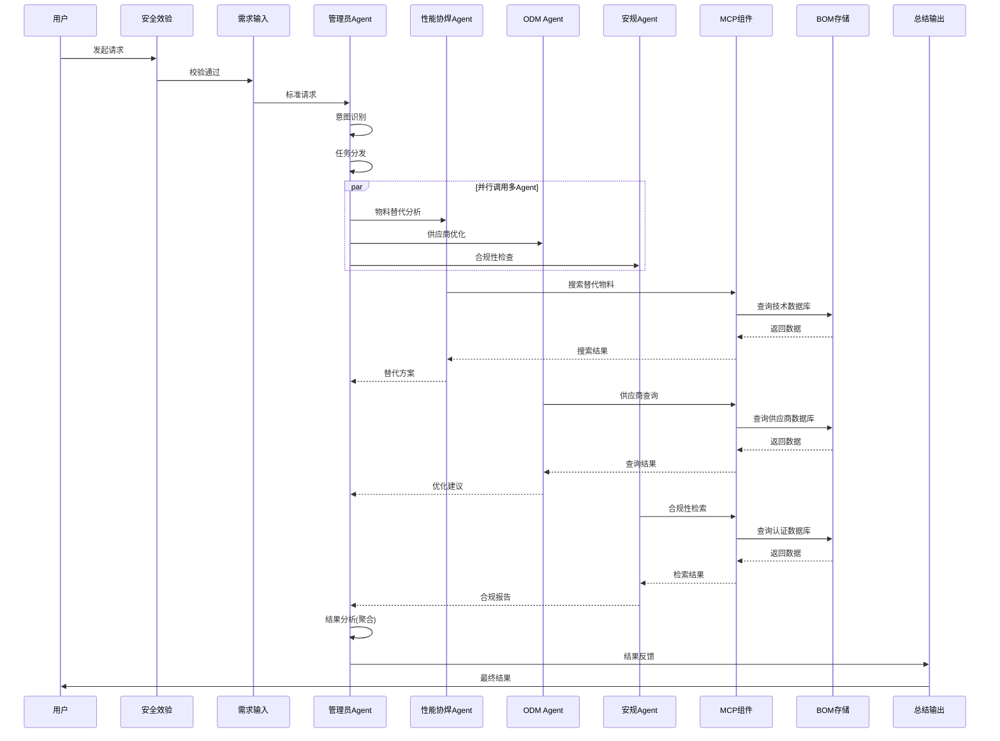

# Agent智能交互系统架构分析

## 📊 **系统概述**

Agent智能交互系统是一个基于多Agent协作的智能服务平台,通过用户交互组件、管理员Agent组件、专家Agent组件和MCP组件的协同工作,实现从用户需求输入到智能结果输出的完整闭环。

---

## 🏗️ **系统架构全景**

### 核心组件关系
```
用户交互组件 ←→ 管理员Agent组件 ←→ 专家Agent组件 ←→ MCP组件
      ↓                                                    ↓
策略配置 ←――――――――――――――――→ 超级BOM多态存储模块
```

### 数据流转流程
```
用户输入 → 安全校验 → 意图识别 → 任务分发 → 多Agent并行处理
    ↓                                          ↓
结果输出 ← 结果反馈 ← 结果分析 ←――――――――― Agent结果聚合
```

---

## 💡 **一、用户交互组件**

### 1.1 安全效验

**功能**: 用户身份认证、权限校验、输入验证、频率限制

**安全检查项**:
- 身份认证(JWT/SSO)
- 权限校验(RBAC)
- 输入验证(XSS/SQL注入防护)
- 频率限制(令牌桶算法)

**实现示例**:
```python
class SecurityValidator:
    def validate_request(self, request):
        # 1. 身份认证
        user = self._authenticate(request)
        if not user:
            raise AuthenticationError("身份认证失败")
        
        # 2. 权限校验
        if not self._authorize(user, request.endpoint):
            raise AuthorizationError("权限不足")
        
        # 3. 输入验证
        if not self._validate_input(request.data):
            raise ValidationError("输入参数非法")
        
        # 4. 频率限制
        if not self.rate_limiter.check(user.id):
            raise RateLimitError("请求过于频繁")
        
        return user
```

---

### 1.2 需求输入

**功能**: 接收用户输入、格式规范化、上下文收集、多模态支持

**输入处理流程**:
```
用户输入 → 格式规范化 → 上下文收集 → 多模态转换 → 标准请求对象
```

**多模态支持**:
- **文本输入**: 自然语言理解
- **语音输入**: 语音识别转文本
- **图片输入**: 图像描述生成

**实现示例**:
```python
class UserInputHandler:
    def process_input(self, user_input, user_id, session_id):
        # 1. 识别输入类型
        input_type = self._detect_input_type(user_input)
        
        # 2. 多模态转文本
        text_input = self._convert_to_text(user_input, input_type)
        
        # 3. 文本规范化
        normalized_text = self._normalize_text(text_input)
        
        # 4. 收集上下文
        context = self.context_manager.get_context(user_id, session_id)
        
        # 5. 构建请求对象
        return {
            "user_id": user_id,
            "session_id": session_id,
            "input_text": normalized_text,
            "input_type": input_type,
            "context": context,
            "user_profile": self._get_user_profile(user_id)
        }
```

---

### 1.3 总结输出

**功能**: 结果格式化、可视化生成、可解释性增强、多渠道输出

**输出格式**:
- **富文本输出**: Markdown + 图表
- **纯文本输出**: 简洁摘要
- **JSON输出**: 结构化数据

**实现示例**:
```python
class OutputSummarizer:
    def generate_output(self, result_data, output_format='rich'):
        # 1. 提取核心内容
        core_content = self._extract_core_content(result_data)
        
        # 2. 格式化输出
        if output_format == 'rich':
            output = self._generate_rich_output(core_content)
        
        # 3. 添加可解释性
        output = self._add_explainability(output, result_data)
        
        return output
```

**输出示例**:
```markdown
# 分析结果

## 📊 摘要
针对BOM SB-001的成本优化分析,预计可降低成本8-12%

## 🎯 主要发现
1. 高成本物料替代机会(预计节省3.7%)
2. 供应商优化(降低风险)
3. 批量采购优化(节省8%)

## 💡 优化建议
- 短期: 启动国产芯片替代验证
- 中期: 完成备用供应商准入
- 长期: 建立集中采购机制

## 🔍 分析过程说明
**置信度**: 85.3%
**参与Agent**: 性能协焊Agent、ODM Agent、安规Agent
```

---

## 🤖 **二、管理员Agent组件**

### 2.1 意图识别

**功能**: 理解用户意图、识别任务类型、提取关键参数

**意图分类**:
| 一级意图 | 二级意图 | 示例 |
|---------|---------|------|
| 查询类 | BOM查询、成本查询 | "查询SB-001的BOM" |
| 分析类 | 成本分析、结构分析 | "分析BOM成本结构" |
| 优化类 | 成本优化、供应链优化 | "如何降低成本" |
| 执行类 | BOM创建、数据导出 | "创建新BOM" |

**技术实现**:
```python
class IntentRecognizer:
    def recognize(self, user_request):
        text = user_request['input_text']
        
        # 1. BERT模型意图分类
        intent_probs = self._classify_intent(text)
        primary_intent = max(intent_probs, key=intent_probs.get)
        
        # 2. NER实体提取
        entities = self._extract_entities(text)
        
        # 3. 参数提取
        parameters = self._extract_parameters(text, entities)
        
        return {
            "intent": primary_intent,
            "confidence": intent_probs[primary_intent],
            "entities": entities,
            "parameters": parameters
        }
```

---

### 2.2 任务分发

**功能**: 选择专家Agent、任务分解、并行调度、失败重试

**分发策略**:
| 意图类型 | 主责Agent | 执行模式 |
|---------|----------|---------|
| BOM成本优化 | ODM Agent + 性能协焊Agent + 安规Agent | 并行 |
| 物料替代分析 | 性能协焊Agent | 单一 |
| 供应商风险评估 | ODM Agent | 单一 |

**实现示例**:
```python
class TaskDispatcher:
    def dispatch(self, intent_result, user_request):
        # 1. 确定Agent列表
        agent_tasks = self._plan_agent_tasks(intent_result['intent'])
        
        # 2. 检查可用性
        available_agents = self._check_agent_availability(agent_tasks)
        
        # 3. 并行执行
        results = self._execute_parallel(available_agents, user_request)
        
        return results
```

---

### 2.3 结果分析

**功能**: 聚合Agent结果、一致性检查、冲突消解、质量评估

**聚合策略**:
| 场景 | 处理方式 |
|-----|---------|
| 多Agent一致 | 直接采纳,置信度加权 |
| 部分冲突 | 投票机制,采纳多数 |
| 完全冲突 | 标记需澄清 |

**实现示例**:
```python
class ResultAnalyzer:
    def analyze(self, agent_results, intent_result):
        # 1. 过滤有效结果
        valid_results = self._filter_valid_results(agent_results)
        
        # 2. 检查一致性
        consistency_score = self._check_consistency(valid_results)
        
        # 3. 聚合结果
        if consistency_score > 0.8:
            aggregated = self._aggregate_consistent_results(valid_results)
        else:
            aggregated = self._resolve_conflicts(valid_results)
        
        # 4. 质量评估
        quality_score = self._assess_quality(aggregated, valid_results)
        
        return {
            "aggregated_results": aggregated,
            "consistency_score": consistency_score,
            "quality_score": quality_score
        }
```

---

### 2.4 结果反馈

**功能**: 格式转换、生成建议、更新上下文、触发动作

**实现示例**:
```python
class ResultFeedback:
    def generate_feedback(self, analysis_result, intent_result, user_request):
        feedback = {
            "summary": analysis_result['aggregated_results']['summary'],
            "recommendations": self._format_recommendations(
                analysis_result['aggregated_results']['recommendations']
            ),
            "confidence": analysis_result['quality_score'],
            "reasoning_steps": self._generate_reasoning_steps(analysis_result),
            "next_actions": self._suggest_next_actions(intent_result)
        }
        
        # 更新上下文
        self._update_context(user_request, feedback)
        
        # 触发后续动作
        self._trigger_actions(feedback, user_request)
        
        return feedback
```

---

## 👨‍🔬 **三、专家Agent组件**

### 3.1 性能协焊Agent

**领域**: 物料性能分析、技术可行性评估、替代方案推荐

**核心能力**:
- 物料技术参数分析
- 替代物料匹配(技术可行性评分)
- 性能影响评估
- 工艺兼容性分析

**实现示例**:
```python
class PerformanceAgent:
    def find_alternatives(self, input_data):
        bom_id = input_data['parameters']['bom_id']
        materials = self._get_bom_materials(bom_id)
        
        alternatives_list = []
        for material in materials:
            # MCP搜索替代物料
            search_results = self.mcp_client.search(
                query=f"替代物料 {material['spec']}",
                source="technical_database"
            )
            
            # 技术可行性评估
            feasible = [
                alt for alt in search_results
                if self._assess_technical_feasibility(material, alt) > 0.7
            ]
            
            alternatives_list.append({
                "original_material": material,
                "alternatives": feasible[:3]
            })
        
        return {
            "summary": f"识别出{len(alternatives_list)}个物料有替代方案",
            "alternatives": alternatives_list,
            "confidence": 0.85
        }
```

---

### 3.2 ODM Agent

**领域**: 供应商管理、采购成本优化、供应链风险评估

**核心能力**:
- 供应商绩效分析
- 采购成本优化(批量采购、价格谈判)
- 供应链风险识别(单一供应商、集中度)
- 备用供应商推荐

**实现示例**:
```python
class ODMAgent:
    def optimize_supplier_structure(self, input_data):
        bom_id = input_data['parameters']['bom_id']
        
        # 分析当前供应商结构
        current_structure = self._analyze_current_suppliers(bom_id)
        
        # 识别风险
        risks = []
        if current_structure['single_supplier_count'] > 0:
            risks.append({
                "type": "单一供应商风险",
                "severity": "高"
            })
        
        # 推荐备用供应商
        backup_recommendations = self._find_backup_suppliers(
            current_structure['single_supplier_materials']
        )
        
        return {
            "summary": f"识别出{len(risks)}个供应链风险点",
            "risks": risks,
            "recommendations": backup_recommendations,
            "confidence": 0.88
        }
```

---

### 3.3 安规Agent

**领域**: 法规合规性检查、安全标准验证、认证评估

**核心能力**:
- 国内外法规合规检查(RoHS/REACH)
- 安全标准符合性验证
- 认证要求评估
- 合规风险预警

**实现示例**:
```python
class ComplianceAgent:
    def check_compliance(self, input_data):
        bom_id = input_data['parameters']['bom_id']
        materials = self._get_bom_materials(bom_id)
        
        compliance_results = []
        for material in materials:
            # RoHS检查
            rohs_check = self._check_rohs(material)
            # REACH检查
            reach_check = self._check_reach(material)
            
            if not all([rohs_check['compliant'], reach_check['compliant']]):
                compliance_results.append({
                    "material_id": material['material_id'],
                    "rohs_compliant": rohs_check['compliant'],
                    "reach_compliant": reach_check['compliant']
                })
        
        compliance_rate = 1 - len(compliance_results) / len(materials)
        
        return {
            "summary": f"BOM合规率{compliance_rate:.1%}",
            "non_compliant_materials": compliance_results,
            "confidence": 0.95
        }
```

---

## 🛠️ **四、MCP组件(Model Context Protocol)**

### 4.1 模块概述

MCP组件为专家Agent提供工具调用能力,包括搜索引擎、沙盒计算、数据库查询等。

### 4.2 核心工具

#### 4.2.1 搜索引擎

**功能**: 多源数据检索、语义搜索、结果排序

**数据源**:
- 技术数据库(物料规格、技术参数)
- 供应商数据库(供应商信息、报价)
- 认证数据库(RoHS/REACH认证)
- 知识库(技术文档、最佳实践)

**实现示例**:
```python
class SearchEngine:
    def search(self, query, source, top_k=10):
        if source == "technical_database":
            # Elasticsearch全文检索
            results = self.es_client.search(
                index="technical_materials",
                body={"query": {"match": {"description": query}}}
            )
        elif source == "supplier_database":
            # SQL查询
            results = self.db.execute(
                "SELECT * FROM suppliers WHERE name LIKE %s",
                (f"%{query}%",)
            )
        
        # 结果排序(相关性 + 质量分)
        ranked_results = self._rank_results(results, query)
        return ranked_results[:top_k]
```

---

#### 4.2.2 沙盒计算

**功能**: 安全代码执行、复杂计算、数据分析

**应用场景**:
- BOM成本计算(递归汇总)
- 优化算法求解(线性规划)
- 数据统计分析

**实现示例**:
```python
class SandboxCompute:
    def execute(self, code, context, timeout=30):
        # 创建隔离环境
        sandbox = RestrictedPython()
        
        # 设置安全限制
        sandbox.set_limits(
            memory_mb=256,
            cpu_time_sec=30,
            network_access=False
        )
        
        # 注入上下文数据
        sandbox.set_globals(context)
        
        # 执行代码
        result = sandbox.exec(code, timeout=timeout)
        
        return result
```

**使用示例**:
```python
# Agent调用沙盒计算BOM总成本
code = """
def calculate_total_cost(bom_items):
    total = 0
    for item in bom_items:
        total += item['quantity'] * item['unit_cost']
    return total

result = calculate_total_cost(bom_items)
"""

result = mcp_client.sandbox_compute(
    code=code,
    context={"bom_items": materials}
)
```

---

#### 4.2.3 其他工具(...)

**数据库查询工具**:
- 超级BOM数据库查询
- 历史数据追溯
- 统计分析

**API调用工具**:
- 第三方API集成(汇率、市场价格)
- 内部系统接口(PLM/ERP)

**文件处理工具**:
- PDF解析
- Excel数据提取
- 报告生成

---

## 📦 **五、存储层**

### 5.1 策略配置

**功能**: 系统配置管理、Agent策略配置、规则引擎

**配置内容**:
- **Agent配置**: 权重、优先级、超时时间
- **意图识别配置**: 意图模板、NER规则
- **任务分发策略**: Agent选择规则
- **结果聚合策略**: 冲突解决规则

**配置示例**(YAML):
```yaml
agents:
  性能协焊Agent:
    weight: 1.2
    timeout: 30
    enabled: true
  ODM_Agent:
    weight: 1.0
    timeout: 25
    enabled: true
  安规Agent:
    weight: 1.5
    timeout: 20
    enabled: true

intent_mapping:
  优化类-成本优化:
    agents: [ODM_Agent, 性能协焊Agent, 安规Agent]
    execution_mode: parallel
  分析类-成本分析:
    agents: [ODM_Agent]
    execution_mode: single

result_aggregation:
  consistency_threshold: 0.8
  conflict_resolution: voting
  quality_weight:
    completeness: 0.3
    confidence: 0.4
    coverage: 0.3
```

---

### 5.2 超级BOM多态存储模块

**功能**: 与前述"超级BOM系统后端模块"集成,提供数据持久化

**存储内容**:
- BOM主数据(关系型数据库)
- 设计文档(文档数据库)
- BOM关系图(图数据库)
- 历史变更(时序数据库)

**数据接口**:
```python
class BOMStorage:
    def get_bom(self, bom_id):
        """查询BOM完整信息"""
        return data_scheduler.read_bom(bom_id, query_type='full')
    
    def get_bom_materials(self, bom_id):
        """查询BOM物料清单"""
        return data_scheduler.read_bom(bom_id, query_type='materials')
    
    def get_bom_cost_analysis(self, bom_id):
        """查询BOM成本分析"""
        return cost_analyzer.analyze(bom_id)
```

---

## 🔄 **六、系统交互流程**

### 6.1 完整流程时序图



### 6.2 典型场景流程

**场景**: 用户请求"优化BOM SB-001的成本"

**流程**:
1. **安全效验**: JWT认证 → 权限校验 → 频率检查 ✓
2. **需求输入**: 文本规范化 → 上下文收集(上次查询SB-001) → 构建请求
3. **意图识别**: BERT分类 → "优化类-成本优化"(置信度92%) → 提取参数{bom_id: SB-001}
4. **任务分发**: 
   - ODM Agent(供应商成本优化)
   - 性能协焊Agent(物料替代)
   - 安规Agent(合规性校验)
5. **Agent并行执行**:
   - **性能协焊Agent**: MCP搜索替代物料 → 技术可行性评估 → 返回3个替代方案
   - **ODM Agent**: 分析供应商结构 → 识别单一供应商风险 → 推荐备用供应商
   - **安规Agent**: RoHS/REACH检查 → 所有替代方案合规 → 返回通过
6. **结果分析**: 聚合3个Agent结果 → 一致性检查(88%) → 质量评分(85%)
7. **结果反馈**: 格式化输出 → 生成Markdown报告 → 建议下一步操作
8. **总结输出**: 富文本+图表 → 推送给用户

**输出**:
```
# 成本优化分析结果

预计可降低成本8-12%(约130元/套)

主要优化机会:
1. 芯片替代(节省60元)
2. 批量采购(节省50元)
3. 供应商谈判(节省20元)

置信度: 85%
参与Agent: 性能协焊Agent、ODM Agent、安规Agent
```

---

## 📊 **七、技术架构总结**

### 7.1 技术栈

| 层级 | 技术栈 |
|-----|-------|
| **前端交互** | React/Vue, WebSocket |
| **身份认证** | JWT, OAuth 2.0 |
| **意图识别** | BERT, NER |
| **Agent框架** | LangChain, AutoGen |
| **MCP工具** | Elasticsearch, RestrictedPython |
| **存储** | MySQL, MongoDB, Neo4j, InfluxDB |
| **消息队列** | Kafka, RabbitMQ |
| **缓存** | Redis |

### 7.2 核心优势

1. **多Agent协作**: 分工明确,并行处理,效率高
2. **智能任务分发**: 根据意图自动路由,无需人工干预
3. **结果聚合优化**: 一致性检查+冲突消解,结果可靠
4. **可扩展架构**: 支持动态添加新Agent,灵活适配业务
5. **闭环反馈**: 完整追踪,可解释性强

### 7.3 应用价值

- ✅ **降低使用门槛**: 自然语言交互,无需专业知识
- ✅ **提升决策质量**: 多Agent协同,全面分析
- ✅ **加快响应速度**: 并行处理,秒级返回
- ✅ **增强可信度**: 推理过程透明,结果可追溯
- ✅ **适应多场景**: 查询/分析/优化/执行全覆盖

---

## 📝 **八、系统扩展建议**

### 8.1 Agent扩展

**可新增的专家Agent**:
- **质量Agent**: 质量问题分析、不良率预测
- **工艺Agent**: 工艺路线优化、生产效率提升
- **研发Agent**: 设计复用推荐、创新方案建议
- **财务Agent**: ROI分析、成本预算管理

### 8.2 功能增强

**推荐增强方向**:
- **主动推荐**: 系统主动发现优化机会并推送
- **学习优化**: 基于用户反馈持续优化Agent策略
- **多轮对话**: 支持澄清、追问、深入分析
- **可视化增强**: 交互式图表、动态仪表盘

### 8.3 集成扩展

**外部系统集成**:
- **PLM/ERP系统**: 双向同步,数据一致
- **BI系统**: 分析结果推送到报表
- **审批系统**: 优化方案自动提交审批
- **通知系统**: 邮件/微信/钉钉多渠道推送

---

**文档版本**: v1.0  
**生成时间**: 2025-11-17  
**适用范围**: Agent智能交互系统架构设计与实现分析
