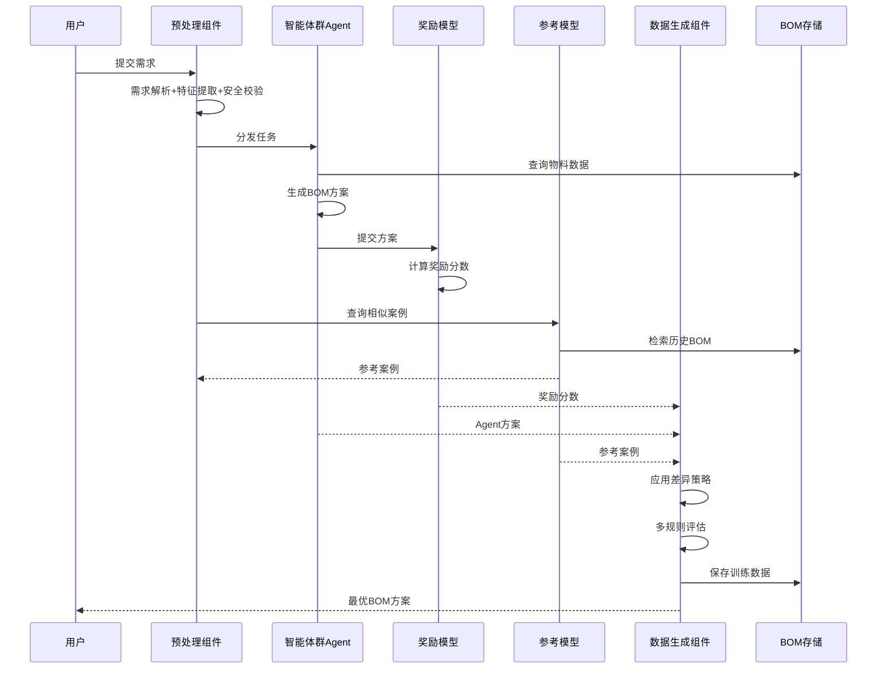

# 智能BOM决策系统模块架构分析

## 📊 **系统概述**

智能BOM决策系统是一个基于多Agent协作和强化学习的智能决策平台,通过预处理组件、智能体群策略模型组件、奖励模型组件、参考模型组件和数据生成组件的协同工作,实现从用户需求到智能决策的完整流程。

---

## 🏗️ **系统架构全景**

### 核心组件关系
```
预处理组件 → 智能体群策略模型组件 → 奖励模型组件
     ↓              ↓                    ↓
参考模型组件 ←  数据生成组件 ← 超级BOM数据生成模块
     ↓                                  ↓
超级BOM多态存储模块 ←――――――――――――――――→
```

---

## 💡 **一、预处理组件**

### 1.1 用户需求输入

**功能**: 接收用户需求、格式规范化、初步需求理解

**需求类型**: BOM优化、新品设计、替代方案、合规性检查

**实现示例**:
```python
class UserRequirementInput:
    def process_requirement(self, user_input):
        # 1. 输入验证
        if not self.validator.validate(user_input):
            raise ValueError("输入格式不合法")
        
        # 2. 需求类型识别
        requirement_type = self._identify_requirement_type(user_input)
        
        # 3. 需求解析
        parsed_requirement = self.requirement_parser.parse(user_input, requirement_type)
        
        return {
            "requirement_type": requirement_type,
            "raw_input": user_input,
            "parsed_data": parsed_requirement
        }
```

---

### 1.2 需求特征提取

**功能**: 提取关键特征、结构化需求、生成特征向量

**提取维度**:
- 产品特征(类型、规格、功能)
- 约束条件(成本、交期、质量)
- 优化目标(成本最优、性能最优)
- 合规要求(法规、认证)

**实现示例**:
```python
class FeatureExtractor:
    def extract_features(self, parsed_requirement):
        # 1. 实体提取(NER)
        entities = self.ner_model.extract_entities(text)
        
        # 2. 参数提取
        parameters = self._extract_parameters(text, entities)
        
        # 3. 约束提取
        constraints = self._extract_constraints(text)
        
        # 4. 目标提取
        objectives = self._extract_objectives(text)
        
        # 5. 生成特征向量
        feature_vector = self.embedding_model.encode(text)
        
        return {
            "entities": entities,
            "parameters": parameters,
            "constraints": constraints,
            "objectives": objectives,
            "feature_vector": feature_vector.tolist()
        }
```

**示例输出**:
```json
{
  "parameters": {"voltage": "12V", "power": "10W", "max_cost": 200.0},
  "constraints": [
    {"type": "cost", "operator": "<=", "value": 200.0},
    {"type": "certification", "value": "CE"}
  ],
  "objectives": [
    {"type": "cost_minimization", "weight": 0.4}
  ]
}
```

---

### 1.3 安全校验

**功能**: 合法性校验、权限验证、资源检查、风险评估

**校验流程**:
```
合法性校验 → 权限校验 → 资源校验 → 风险评估 → 通过/拒绝
```

**实现示例**:
```python
class SafetyValidator:
    def validate(self, user_input, extracted_features, user_id):
        # 1. 合法性校验
        legality_check = self._check_legality(extracted_features)
        
        # 2. 权限校验
        permission_check = self._check_permission(user_id, extracted_features)
        
        # 3. 资源校验
        resource_check = self._check_resources()
        
        # 4. 风险评估
        risk_assessment = self.risk_detector.assess(user_input)
        
        return {
            "is_valid": all([legality_check['is_valid'], 
                            permission_check['is_valid']]),
            "risk_level": risk_assessment['level']
        }
```

---

## 🤖 **二、智能体群策略模型组件**

### 2.1 性能规格Agent

**职责**: 技术规格分析、性能评估、技术可行性验证

**决策流程**:
```
技术需求解析 → 物料检索 → 性能评估 → BOM组装 → 方案输出
```

**实现示例**:
```python
class PerformanceSpecAgent:
    def generate_bom_proposal(self, requirement_features):
        # 1. 解析技术需求
        tech_specs = requirement_features['structured_features']['technical_specs']
        
        # 2. 检索符合规格的物料
        candidate_materials = self._search_matching_materials(tech_specs)
        
        # 3. 性能评估
        evaluated_materials = [
            material for material in candidate_materials
            if self.performance_evaluator.evaluate(material, tech_specs) > 0.7
        ]
        
        # 4. 组装BOM
        bom_proposal = self._assemble_bom(evaluated_materials, tech_specs)
        
        return {
            "agent_name": "性能规格Agent",
            "proposal": bom_proposal,
            "confidence": 0.87
        }
```

---

### 2.2 安规Agent

**职责**: 法规合规检查、认证验证、安全风险识别

**实现示例**:
```python
class ComplianceAgent:
    def validate_compliance(self, bom_proposal, requirement_features):
        required_certs = requirement_features['structured_features'].get('certifications_required', [])
        
        compliance_results = []
        for item in bom_proposal['bom_items']:
            # 检查各项认证
            cert_results = {
                cert: self._check_certification(item['material']['material_id'], cert)
                for cert in required_certs
            }
            
            compliance_results.append({
                "material_id": item['material']['material_id'],
                "is_compliant": all(cert_results.values())
            })
        
        compliance_rate = sum(1 for r in compliance_results if r['is_compliant']) / len(compliance_results)
        
        return {
            "agent_name": "安规Agent",
            "compliance_rate": compliance_rate,
            "overall_status": "PASS" if compliance_rate == 1.0 else "FAIL"
        }
```

---

## 🎁 **三、奖励模型组件**

### 3.1 成本Agent

**功能**: 评估BOM成本表现,计算奖励分数

**评估维度**:
- 总成本控制(50%)
- 成本结构合理性(30%)
- 价格稳定性(20%)

**奖励计算**:
```python
class CostRewardAgent:
    def calculate_reward(self, bom_proposal, requirement_features):
        total_cost = self._calculate_total_cost(bom_proposal)
        cost_limit = requirement_features['structured_features'].get('cost_limit')
        
        # 1. 成本控制奖励
        cost_control_reward = self._cost_control_reward(total_cost, cost_limit)
        
        # 2. 成本结构奖励
        cost_structure_reward = self._cost_structure_reward(bom_proposal)
        
        # 3. 价格稳定性奖励
        price_stability_reward = self._price_stability_reward(bom_proposal)
        
        # 4. 综合奖励
        total_reward = (
            cost_control_reward * 0.5 +
            cost_structure_reward * 0.3 +
            price_stability_reward * 0.2
        )
        
        return {
            "agent_name": "成本Agent",
            "total_cost": total_cost,
            "total_reward": total_reward
        }
```

**奖励分数示例**:
```json
{
  "total_cost": 185.50,
  "cost_limit": 200.0,
  "cost_control_reward": 0.82,
  "cost_structure_reward": 0.75,
  "price_stability_reward": 0.88,
  "total_reward": 0.814
}
```

---

## 📚 **四、参考模型组件**

### 4.1 相似BOM检索

**功能**: 检索历史相似BOM,提供设计参考

**相似度计算**:
```python
class SimilarBOMRetrieval:
    def retrieve_similar_boms(self, requirement_features, top_k=5):
        # 1. 向量检索
        query_vector = requirement_features['feature_vector']
        vector_results = self.vector_db.search(
            collection_name="bom_embeddings",
            query_vectors=[query_vector],
            top_k=top_k * 2
        )
        
        # 2. 计算综合相似度
        filtered_results = []
        for result in vector_results:
            bom_data = self.bom_storage.get_bom(result['id'])
            similarity_score = self._calculate_similarity(requirement_features, bom_data)
            
            if similarity_score > 0.6:
                filtered_results.append({
                    "bom_id": result['id'],
                    "similarity_score": similarity_score
                })
        
        return sorted(filtered_results, key=lambda x: x['similarity_score'], reverse=True)[:top_k]
```

**检索结果**:
```json
{
  "similar_boms": [
    {
      "bom_id": "SB-0123",
      "similarity_score": 0.89,
      "match_reasons": ["技术规格匹配", "成本相近", "产品类型一致"]
    }
  ]
}
```

---

### 4.2 相似需求检索

**功能**: 检索历史相似需求及其解决方案

**实现**: 基于语义向量检索历史需求,获取解决方案和经验教训

---

## 📊 **五、数据生成组件**

### 5.1 应用差异策略

**功能**: 对比多Agent方案差异,提取优劣特征

**实现示例**:
```python
class DifferenceStrategy:
    def analyze_differences(self, agent_proposals, reward_scores, reference_boms):
        # 1. 构建对比矩阵
        comparison_matrix = self._build_comparison_matrix(agent_proposals)
        
        # 2. 提取关键差异
        key_differences = self._extract_key_differences(comparison_matrix)
        
        # 3. 与参考案例对比
        reference_gaps = self._compare_with_reference(agent_proposals, reference_boms)
        
        return {
            "key_differences": key_differences,
            "reference_gaps": reference_gaps
        }
```

**差异分析维度**: 成本差异、物料数量差异、性能差异、合规性差异

---

### 5.2 多规则评估

**功能**: 基于多维规则评估BOM质量,生成综合评分

**评估规则权重**:
| 规则 | 权重 |
|-----|------|
| 成本规则 | 30% |
| 性能规则 | 25% |
| 合规规则 | 20% |
| 供应链规则 | 15% |
| 质量规则 | 10% |

**实现示例**:
```python
class MultiRuleEvaluator:
    def evaluate(self, bom_proposal, requirement_features, reward_scores):
        # 1. 各维度评分
        scores = {
            "cost": self._evaluate_cost(bom_proposal, reward_scores),
            "performance": self._evaluate_performance(bom_proposal),
            "compliance": self._evaluate_compliance(bom_proposal),
            "supply_chain": self._evaluate_supply_chain(bom_proposal),
            "quality": self._evaluate_quality(bom_proposal)
        }
        
        # 2. 加权综合
        total_score = sum(scores[d] * self.rule_weights[d] for d in scores)
        
        return {
            "total_score": total_score,
            "grade": self._get_grade(total_score),
            "dimension_scores": scores
        }
```

**评估结果**:
```json
{
  "total_score": 0.83,
  "dimension_scores": {
    "cost": 0.88,
    "performance": 0.85,
    "compliance": 0.92,
    "supply_chain": 0.75,
    "quality": 0.80
  },
  "grade": "良好"
}
```

---

## 🗄️ **六、数据层**

### 6.1 超级BOM多态存储模块

**功能**: 数据持久化(MySQL/MongoDB/Neo4j/InfluxDB)

**数据接口**:
```python
# 查询BOM
bom_data = BOMStorage().get_bom(bom_id)

# 查询物料
materials = BOMStorage().get_materials(filter_conditions)
```

---

### 6.2 超级BOM数据生成模块

**功能**: 生成训练数据,反馈到存储模块

**数据生成流程**:
```
多Agent方案 + 奖励评分 + 参考案例
  ↓
应用差异策略
  ↓
多规则评估
  ↓
数据质量检查
  ↓
保存训练数据
  ↓
反馈到存储模块
```

---

## 🔄 **七、系统完整流程**

### 端到端流程



### 典型场景示例

**需求**: 设计DC 12V 10W智能控制器,成本≤200元,需CE认证

**流程**:
1. **预处理**: 提取特征{voltage:12V, power:10W, cost≤200, cert:CE}
2. **Agent决策**: 性能规格Agent生成方案(成本195元)、安规Agent验证(CE通过)
3. **奖励模型**: 成本Agent评分0.82
4. **参考模型**: 检索到2个相似BOM(相似度0.89)
5. **数据生成**: 差异分析、多规则评估(总分0.83)
6. **输出**: 推荐方案并保存训练数据

---

## 📊 **八、技术架构总结**

### 核心技术

| 技术领域 | 技术栈 |
|---------|-------|
| NLP | BERT, Sentence-BERT, NER |
| 强化学习 | 奖励模型, 策略优化 |
| 检索 | Milvus, Elasticsearch |
| Agent框架 | LangChain, AutoGen |
| 存储 | MySQL, MongoDB, Neo4j, InfluxDB |

### 核心优势

1. **多Agent协作**: 专家分工,决策全面
2. **强化学习**: 奖励驱动,持续优化
3. **参考学习**: 历史经验借鉴
4. **数据闭环**: 决策反馈训练,正向循环
5. **可解释性**: 差异分析+多规则评估,决策透明

### 应用价值

- ✅ **提升设计效率**: 自动生成BOM,缩短周期
- ✅ **降低设计成本**: AI优化降本8-15%
- ✅ **保障合规性**: 自动校验,降低风险
- ✅ **积累知识**: 形成企业设计知识库
- ✅ **辅助决策**: 多方案对比

---

## 🚀 **九、系统扩展建议**

### 9.1 Agent扩展
- 增加工艺Agent(生产工艺适配)
- 增加质量Agent(可靠性分析)
- 增加供应链Agent(交期管理)

### 9.2 模型优化
- 引入深度强化学习(DQN/PPO)
- 优化奖励函数(多目标优化)
- 增强迁移学习(跨产品线)

### 9.3 功能增强
- 支持多轮对话(澄清需求)
- 增加可视化设计工具
- 支持在线学习(用户反馈)

---

**文档版本**: v1.0  
**生成时间**: 2025-11-17  
**适用范围**: 智能BOM决策系统架构设计与实现分析
