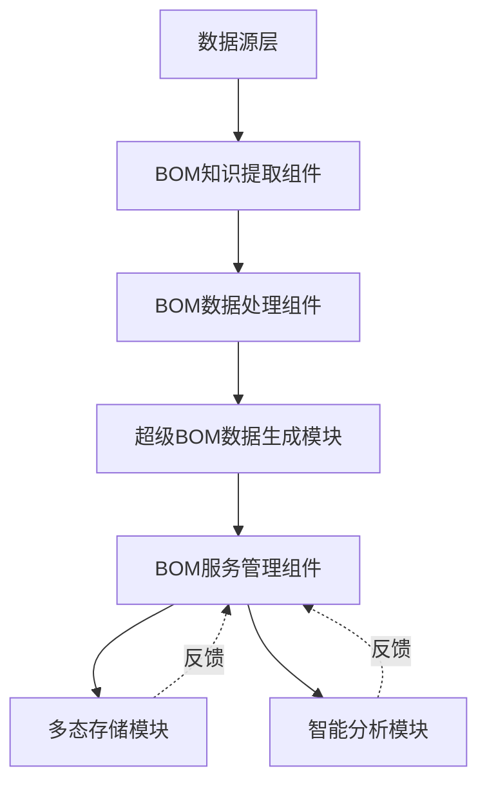

# 超级BOM系统子模块详细分析

## 📊 **一、数据源层**

这是系统的最上游,负责提供原始数据输入:

### 1. **本地多源数据**
- **功能**: 从企业内部各种本地数据源采集数据
- **数据类型**: 文件系统、本地数据库、历史归档数据
- **特点**: 数据格式多样,需要统一处理
- **典型来源**:
  - 文件服务器 (Excel、CSV、XML文件)
  - 本地数据库 (Access、SQLite)
  - 历史归档系统
  - 部门共享盘

### 2. **原始BOM数据**
- **功能**: 获取现有系统中的BOM原始数据
- **来源**: 现有PLM/PDM/ERP系统
- **特点**: 结构化程度高,但可能存在不一致性
- **数据内容**:
  - BOM结构树 (父子关系)
  - 物料清单明细
  - 版本信息
  - 变更记录

### 3. **网络数据**
- **功能**: 从互联网采集外部数据
- **数据类型**: 
  - 行业标准 (GB/ISO标准文档)
  - 供应商信息 (官网、企查查)
  - 物料参数 (电子元器件库)
  - 市场价格 (采购平台、交易所)
- **特点**: 数据量大,需要爬虫和清洗
- **更新频率**: 实时/每日/每周

---

## 🔍 **二、BOM知识提取组件 (知识治理模块)**

负责从数据源中提取和采集数据,这是知识治理模块的核心组成部分。

### 1. **文档型数据库提取**

#### 1.1 目标数据源
- MongoDB (文档数据库)
- Elasticsearch (搜索引擎)
- Couchbase (键值文档数据库)
- CouchDB

#### 1.2 提取内容
- **设计文档**: 
  - 产品设计说明书
  - 技术规范文档
  - 设计变更通知单 (ECN)
- **工艺文档**: 
  - 工艺卡片
  - 作业指导书
  - 工艺路线
- **质量标准**: 
  - 检验标准
  - 质量控制计划
- **历史变更记录**: 
  - 变更申请单
  - 审批流程记录

#### 1.3 技术手段
- NoSQL查询API (MongoDB Query API)
- 全文检索 (Elasticsearch DSL)
- 批量导出接口
- 增量同步机制

#### 1.4 数据解析
- JSON/BSON解析
- 富文本内容提取
- 附件文件处理 (PDF/Word解析)

---

### 2. **关系型数据库提取**

#### 2.1 目标数据源
- **Oracle**: 大型企业PLM/ERP主数据库
- **MySQL**: 中小企业业务系统
- **SQL Server**: 制造执行系统 (MES)
- **PostgreSQL**: 开源系统数据库

#### 2.2 提取内容
- **BOM主数据表**: 
  - BOM头表 (BOM_HEADER)
  - BOM明细表 (BOM_ITEM)
  - BOM结构关系表 (BOM_STRUCTURE)
- **物料主数据**: 
  - 物料基本信息 (MATERIAL_MASTER)
  - 物料分类 (MATERIAL_CLASS)
  - 物料属性扩展表
- **供应商信息**: 
  - 供应商主数据 (VENDOR_MASTER)
  - 供应商物料关联表
  - 供应商资质信息
- **成本数据**: 
  - 物料标准成本
  - 采购价格历史
  - 成本要素分解

#### 2.3 技术手段
- **SQL查询**: 
  ```sql
  SELECT b.bom_id, b.version, bi.item_id, m.material_name
  FROM BOM_HEADER b
  JOIN BOM_ITEM bi ON b.bom_id = bi.bom_id
  JOIN MATERIAL_MASTER m ON bi.material_id = m.material_id
  WHERE b.status = 'ACTIVE'
  ```
- **JDBC/ODBC连接**: 数据库连接池管理
- **增量同步**: 基于时间戳或序列号的增量抽取
- **CDC技术**: Change Data Capture实时捕获变更

#### 2.4 性能优化
- 分批次读取 (每批10000条)
- 并行抽取 (多线程/多进程)
- 索引优化建议
- 查询结果缓存

---

### 3. **网络爬虫引擎**

#### 3.1 爬取目标
- **供应商官网**: 
  - 产品目录
  - 技术参数表
  - 最新报价
  - 库存状态
- **行业标准网站**: 
  - 国家标准网 (GB标准)
  - ISO标准库
  - 行业协会标准
- **电子元器件参数库**: 
  - 芯片规格书 (Datasheet)
  - 元器件替代型号
  - 生命周期状态
- **市场价格信息**: 
  - 大宗商品价格 (钢材、铜材)
  - 电子元器件行情
  - 供应链采购平台价格

#### 3.2 技术手段
- **通用爬虫框架**: 
  - Scrapy (Python) - 分布式爬虫
  - Selenium - 动态网页渲染
  - Puppeteer - 无头浏览器
- **API接口调用**: 
  - REST API
  - GraphQL
  - SOAP Web Service
- **定时调度**: 
  - Cron定时任务
  - 消息队列触发
  - 事件驱动爬取

#### 3.3 反爬策略
- **IP代理池**: 
  - 动态IP轮换
  - 代理IP质量检测
  - 地理位置分布
- **请求频率控制**: 
  - 随机延迟 (1-5秒)
  - 指数退避策略
  - 令牌桶限流
- **User-Agent轮换**: 
  - 模拟不同浏览器
  - 随机UA生成
  - 真实浏览器指纹

#### 3.4 数据存储
- 原始HTML缓存
- 结构化数据入库
- 爬取日志记录

---

## 🧹 **三、BOM数据处理组件 (数据清洗与标准化)**

对采集的原始数据进行处理,保证数据质量。三个子模块形成流水线处理流程。

### 1. **数据清洗**

#### 1.1 主要任务

##### (1) 去重处理
- **记录级去重**: 
  - 基于主键 (BOM编号+版本号)
  - MD5哈希值比对
  - 相似度算法 (编辑距离)
- **字段级去重**: 
  - 物料编码标准化
  - 供应商名称归一化

##### (2) 格式标准化
- **日期格式**: 
  - 统一为 ISO 8601 (2025-11-17)
  - 时区转换 (UTC标准时间)
- **数值格式**: 
  - 千分位分隔符去除
  - 科学计数法转换
  - 精度统一 (保留4位小数)
- **编码格式**: 
  - 字符编码统一 (UTF-8)
  - 大小写规范
  - 前导零补齐

##### (3) 空值处理
- **默认值填充**: 
  - 数值型: 填充0或-1
  - 字符型: 填充"N/A"或"未知"
  - 日期型: 填充当前日期
- **向前填充**: 时间序列数据
- **向后填充**: 特殊场景
- **缺失标记**: 保留NULL并标记

##### (4) 异常值检测
- **统计方法**: 
  - 3σ原则 (正态分布)
  - 四分位距 (IQR)
  - Z-Score标准化
- **业务规则**: 
  - 成本不能为负数
  - 数量必须大于0
  - 日期不能早于1970年
- **机器学习**: 
  - 孤立森林 (Isolation Forest)
  - 局部异常因子 (LOF)

##### (5) 错误修正
- **拼写错误**: 
  - 编辑距离算法
  - 字典匹配
  - 音似算法 (Soundex)
- **编码错误**: 
  - 校验码验证
  - 格式正则匹配
  - 自动纠错

#### 1.2 技术方法
```python
# 数据清洗伪代码示例
def clean_data(raw_data):
    # 去重
    data = raw_data.drop_duplicates(subset=['bom_id', 'version'])
    
    # 格式标准化
    data['create_date'] = pd.to_datetime(data['create_date'])
    data['cost'] = data['cost'].round(4)
    
    # 空值处理
    data['quantity'].fillna(0, inplace=True)
    
    # 异常值检测
    z_scores = (data['cost'] - data['cost'].mean()) / data['cost'].std()
    data = data[abs(z_scores) < 3]
    
    return data
```

---

### 2. **数据筛选**

#### 2.1 主要任务

##### (1) 业务规则过滤
- **状态过滤**: 
  - 只保留"有效"状态的BOM
  - 排除"草稿"、"作废"状态
- **权限过滤**: 
  - 根据数据密级筛选
  - 部门可见性控制
- **范围过滤**: 
  - 特定产品线
  - 特定工厂/事业部

##### (2) 时效性筛选
- **版本筛选**: 
  - 保留最新版本
  - 历史版本归档
- **生效日期**: 
  - 未来生效的BOM暂不处理
  - 已失效的BOM标记
- **有效期检查**: 
  - 物料生命周期状态
  - 供应商资质有效期

##### (3) 质量分级
- **评分维度**: 
  - 完整性得分 (0-100分)
  - 准确性得分 (0-100分)
  - 一致性得分 (0-100分)
- **分级策略**: 
  - A级 (90-100分): 直接使用
  - B级 (70-89分): 人工复核
  - C级 (60-69分): 重点清洗
  - D级 (<60分): 拒绝入库

#### 2.2 筛选维度

| 维度 | 检查项 | 判定标准 |
|-----|--------|---------|
| **数据完整性** | 必填字段是否完整 | 关键字段缺失率<5% |
| **数据一致性** | 跨系统数据是否一致 | 不一致率<3% |
| **数据有效性** | 是否符合业务规则 | 违规率<1% |
| **数据时效性** | 更新时间是否及时 | 延迟<24小时 |

#### 2.3 实现示例
```python
def filter_data(cleaned_data):
    # 状态过滤
    data = cleaned_data[cleaned_data['status'] == 'ACTIVE']
    
    # 时效性过滤
    today = datetime.now()
    data = data[data['effective_date'] <= today]
    data = data[data['expiry_date'] > today]
    
    # 质量评分
    data['quality_score'] = calculate_quality_score(data)
    data = data[data['quality_score'] >= 60]
    
    return data
```

---

### 3. **数据脱敏**

#### 3.1 主要任务

##### (1) 敏感信息加密
- **成本信息**: 
  - 物料采购价格
  - BOM总成本
  - 利润率
  - **加密算法**: AES-256
- **供应商报价**: 
  - 历史报价记录
  - 折扣信息
  - **加密算法**: RSA非对称加密
- **技术机密**: 
  - 配方比例
  - 工艺参数
  - **加密算法**: 国密SM4

##### (2) 个人信息匿名化
- **设计人员**: 
  - 姓名 → 员工ID或角色名
  - 联系方式 → 部门邮箱
- **审批人员**: 
  - 保留角色,隐藏真实姓名
  - 时间戳保留
- **操作日志**: 
  - IP地址脱敏 (保留前三段)
  - 用户名哈希化

##### (3) 商业机密保护
- **核心技术参数**: 
  - 关键尺寸 → 模糊化处理
  - 材料配方 → 代号替换
  - 工艺流程 → 抽象描述
- **客户信息**: 
  - 客户名称编码
  - 订单信息脱敏

#### 3.2 脱敏策略

| 数据类型 | 脱敏方法 | 示例 |
|---------|---------|------|
| **价格信息** | 加密存储 | 128.50 → ENC(AES256) |
| **姓名** | 掩码 | 张三 → 张* |
|          | 替换 | 张三 → User_001 |
| **联系方式** | 部分隐藏 | 13812345678 → 138****5678 |
| **技术参数** | 数值泛化 | 25.6mm → 25-30mm |
| **IP地址** | 部分保留 | 192.168.1.100 → 192.168.1.* |

#### 3.3 权限控制
- **分级授权**: 
  - L1: 只能查看脱敏后数据
  - L2: 可查看部分敏感数据
  - L3: 可查看完整数据
- **审计日志**: 
  - 记录所有敏感数据访问
  - 定期审计
- **动态脱敏**: 
  - 根据用户权限实时脱敏
  - 前端展示控制

#### 3.4 实现示例
```python
from cryptography.fernet import Fernet

def desensitize_data(filtered_data, user_level):
    data = filtered_data.copy()
    
    if user_level < 3:
        # 价格加密
        cipher = Fernet(encryption_key)
        data['cost'] = data['cost'].apply(
            lambda x: cipher.encrypt(str(x).encode())
        )
        
        # 姓名脱敏
        data['designer'] = data['designer'].apply(
            lambda x: x[0] + '*' * (len(x)-1)
        )
        
        # 技术参数泛化
        data['dimension'] = data['dimension'].apply(
            lambda x: f"{int(x/5)*5}-{int(x/5)*5+5}"
        )
    
    return data
```

---

## 🟢 **四、超级BOM数据生成模块**

这是核心数据模型构建模块,负责将清洗后的数据组装成新的数据模型。

### 4.1 主要功能

#### (1) 数据模型组装
- **多维度融合**: 
  - **结构维度**: BOM树形层级关系
  - **成本维度**: 物料成本、加工成本、分摊成本
  - **供应链维度**: 供应商、交期、库存、采购策略
  - **工艺维度**: 加工工序、工艺参数、工时定额
  - **质量维度**: 质量标准、检验要求、合格率

- **关联关系建立**: 
  - 物料间的替代关系 (Substitute)
  - 配套关系 (Kit/Set)
  - 互斥关系 (Exclusive)
  - 可选关系 (Optional)

- **层级结构构建**: 
  ```
  产品 (Level 0)
    ├─ 子组件A (Level 1)
    │   ├─ 零件A1 (Level 2)
    │   └─ 零件A2 (Level 2)
    └─ 子组件B (Level 1)
        └─ 零件B1 (Level 2)
  ```

#### (2) 数据增强
- **自动补全**: 
  - 根据历史数据推断缺失字段
  - 基于规则引擎补全默认值
  - 机器学习预测缺失信息

- **派生字段计算**: 
  - **总成本**: 递归计算所有子项成本
  - **层级深度**: 自动计算BOM最大层级
  - **用量累计**: 计算单个物料在产品中的总用量
  - **关键路径**: 识别影响交期的关键物料链

- **元数据标签**: 
  - 数据来源标签 (源系统标识)
  - 质量等级标签 (A/B/C级)
  - 业务分类标签 (产品线/部门)
  - 时间标签 (创建时间/更新时间)

#### (3) 版本管理
- **版本号生成规则**: 
  - 主版本.次版本.修订号 (如: 2.1.5)
  - 时间戳版本 (如: 20251117_001)
  - Git-like版本 (SHA1哈希)

- **变更历史记录**: 
  - 每次变更的完整快照
  - 变更内容差异 (Diff)
  - 变更原因和审批记录
  - 变更影响范围分析

- **版本关系**: 
  - 父版本 (Parent Version)
  - 分支版本 (Branch)
  - 合并版本 (Merge)

### 4.2 超级BOM数据模型

#### 数据模型结构
```json
{
  "bom_id": "SB-20251117-001",
  "version": "2.1.0",
  "product_info": {
    "product_id": "P-1001",
    "product_name": "智能控制器",
    "product_type": "电子产品"
  },
  "structure": {
    "root_item": {
      "item_id": "I-001",
      "material_id": "M-1001",
      "quantity": 1,
      "unit": "PCS",
      "children": [...]
    },
    "max_level": 5,
    "total_items": 128
  },
  "cost_analysis": {
    "material_cost": 1250.50,
    "labor_cost": 350.00,
    "overhead_cost": 180.00,
    "total_cost": 1780.50,
    "cost_breakdown": [...]
  },
  "supply_chain": {
    "suppliers": [...],
    "lead_time": 30,
    "inventory_status": "充足",
    "risk_level": "低"
  },
  "process_info": {
    "process_route": [...],
    "total_hours": 12.5,
    "critical_process": [...]
  },
  "quality_params": {
    "quality_standard": "GB/T 19001",
    "inspection_points": [...],
    "qualification_rate": 98.5
  },
  "relationships": {
    "substitute_materials": [...],
    "kit_items": [...],
    "optional_items": [...]
  },
  "metadata": {
    "source_system": "PLM",
    "quality_grade": "A",
    "tags": ["新产品", "高优先级"],
    "created_at": "2025-11-17T10:30:00Z",
    "updated_at": "2025-11-17T14:20:00Z",
    "created_by": "User_001",
    "data_lineage": "PLM→知识治理→数据生成"
  },
  "version_control": {
    "parent_version": "2.0.3",
    "change_reason": "物料替代优化",
    "approval_status": "已批准",
    "effective_date": "2025-11-20"
  }
}
```

### 4.3 输出结果

生成的超级BOM包含:

| 数据类别 | 包含内容 | 用途 |
|---------|---------|------|
| **BOM结构树** | 父子层级关系、用量关系 | 产品分解、成本汇总 |
| **物料详细信息** | 参数、规格、供应商、图纸 | 采购、生产、质检 |
| **成本分析数据** | 物料成本、加工成本、分摊成本 | 成本核算、报价 |
| **供应链信息** | 供应商、交期、库存、价格 | 采购计划、风险管控 |
| **设计参数** | 技术规格、替代方案、可选配置 | 设计复用、配置管理 |
| **质量信息** | 质量标准、检验要求、历史问题 | 质量控制、问题追溯 |
| **工艺信息** | 工艺路线、工序参数、工时 | 生产计划、排程 |

---

## 💜 **五、BOM服务管理组件**

提供面向业务的服务能力,是系统对外的主要接口层。

### 1. **数据质量监控**

#### 1.1 监控维度

##### (1) 完整性监控
- **必填字段缺失率**: 
  - 统计公式: 缺失率 = (缺失记录数 / 总记录数) × 100%
  - 告警阈值: >5%
  - 监控字段: BOM编号、物料编号、用量、单位

- **关联关系完整度**: 
  - 孤儿节点检测 (父节点缺失)
  - 死链检测 (引用的物料不存在)
  - 循环引用检测

##### (2) 准确性监控
- **数据格式错误率**: 
  - 日期格式错误
  - 数值格式错误
  - 编码格式不符合规范

- **逻辑冲突数量**: 
  - 用量为负数
  - 成本异常 (为0或超高)
  - 日期逻辑错误 (失效日期早于生效日期)

##### (3) 一致性监控
- **跨系统数据一致性**: 
  - BOM系统 vs PLM系统
  - BOM系统 vs ERP系统
  - 定期对账检查

- **主子表一致性**: 
  - BOM头表总数量 vs 明细表汇总数量
  - 父子关系双向验证

##### (4) 时效性监控
- **数据更新延迟**: 
  - 源系统更新时间 vs 超级BOM更新时间
  - SLA: <4小时

- **版本同步状态**: 
  - 最新版本同步进度
  - 未同步版本数量

#### 1.2 监控功能

- **实时质量评分**: 
  ```
  质量总分 = 完整性得分×30% + 准确性得分×30% 
            + 一致性得分×25% + 时效性得分×15%
  ```

- **质量报告生成**: 
  - 日报: 每日质量快报
  - 周报: 质量趋势分析
  - 月报: 质量改进总结

- **异常数据告警**: 
  - 邮件告警
  - 短信告警 (紧急)
  - 系统消息推送
  - 大屏展示

- **自动修复机制**: 
  - 简单错误自动修复 (格式错误)
  - 复杂错误工单派发
  - 修复结果跟踪

#### 1.3 监控看板
```
┌─────────────────────────────────────┐
│    BOM数据质量监控看板               │
├─────────────────────────────────────┤
│ 总体质量得分: 92分 (优秀)   ↑ +2    │
│                                     │
│ 完整性: 95分 ████████████░░ 95%     │
│ 准确性: 91分 ███████████░░░ 91%     │
│ 一致性: 89分 ██████████░░░░ 89%     │
│ 时效性: 94分 ████████████░░ 94%     │
│                                     │
│ 告警信息:                           │
│ ⚠️  3个BOM存在孤儿节点              │
│ ⚠️  12条记录成本数据缺失            │
│                                     │
│ 最近修复: 26条                      │
└─────────────────────────────────────┘
```

---

### 2. **查询服务**

#### 2.1 查询方式

##### (1) 精确查询
- **BOM编号查询**: 
  - 输入: BOM_ID = "SB-001"
  - 返回: 完整BOM结构树

- **物料编码查询**: 
  - 输入: MATERIAL_ID = "M-1001"
  - 返回: 所有使用该物料的BOM

- **版本查询**: 
  - 输入: BOM_ID + VERSION
  - 返回: 指定版本的BOM快照

##### (2) 模糊查询
- **物料名称模糊搜索**: 
  - 输入: "电阻"
  - 返回: 所有包含"电阻"的物料及其BOM

- **规格模糊搜索**: 
  - 支持通配符 (*, ?)
  - 支持正则表达式

- **全文检索**: 
  - 基于Elasticsearch
  - 支持中文分词
  - 高亮显示匹配词

##### (3) 多维查询
- **成本区间查询**: 
  - 查询成本在1000-5000元的所有BOM

- **供应商维度**: 
  - 查询包含指定供应商物料的BOM

- **设计部门维度**: 
  - 查询特定部门设计的BOM

- **时间范围**: 
  - 查询2025年创建的所有BOM

##### (4) 关联查询
- **物料上下游查询**: 
  - 查询物料A在哪些产品中使用 (Where-Used)
  - 查询产品B由哪些物料组成 (BOM Explosion)

- **替代方案查询**: 
  - 查询物料A的所有可替代物料
  - 查询使用替代物料后的成本影响

- **版本对比查询**: 
  - 查询V2.0相对于V1.0的变更内容

#### 2.2 查询接口

**RESTful API示例**:
```http
# 精确查询
GET /api/bom/{bom_id}

# 模糊查询
GET /api/bom/search?keyword=电阻&fuzzy=true

# 多维查询
GET /api/bom/query?cost_min=1000&cost_max=5000&supplier=S001

# Where-Used查询
GET /api/material/{material_id}/whereused

# BOM展开查询
GET /api/bom/{bom_id}/explosion?level=all
```

#### 2.3 性能优化
- **多级缓存**: 
  - L1缓存: 本地内存 (Caffeine) - 热点数据
  - L2缓存: Redis - 分布式缓存
  - L3缓存: CDN - 静态数据

- **查询结果分页**: 
  - 默认每页50条
  - 支持自定义分页大小
  - 游标分页 (大结果集)

- **索引优化**: 
  - BOM_ID主键索引
  - MATERIAL_ID辅助索引
  - 成本、日期复合索引
  - 全文索引 (物料名称、规格)

- **查询缓存**: 
  - 相同查询条件结果缓存
  - TTL: 5分钟
  - 数据变更自动失效

---

### 3. **订阅服务**

#### 3.1 订阅类型

##### (1) BOM变更订阅
- **订阅对象**: 
  - 单个BOM
  - BOM列表
  - 产品线所有BOM
  - 包含特定物料的所有BOM

- **触发条件**: 
  - 版本发布
  - 状态变更 (草稿→发布)
  - 结构变更 (增删改物料)
  - 成本变更 (超过5%)

- **通知内容**: 
  - 变更摘要
  - 变更对比 (Diff)
  - 影响分析
  - 审批信息

##### (2) 物料价格订阅
- **订阅对象**: 
  - 关键物料清单
  - 物料分类 (如:芯片类)
  - 供应商所有物料

- **触发条件**: 
  - 价格上涨 >10%
  - 价格下跌 >5%
  - 新报价录入

- **通知内容**: 
  - 价格变化幅度
  - 历史价格趋势图
  - 影响的BOM列表
  - 建议操作

##### (3) 供应商变更订阅
- **触发条件**: 
  - 供应商资质到期
  - 供应商评级下降
  - 供应商停供通知
  - 新供应商准入

- **通知内容**: 
  - 变更详情
  - 受影响物料清单
  - 替代供应商建议
  - 风险评估

#### 3.2 通知方式

| 通知方式 | 适用场景 | 时效性 | 支持内容 |
|---------|---------|-------|---------|
| **邮件通知** | 详细变更报告 | 分钟级 | 富文本、附件 |
| **消息队列推送** | 系统间集成 | 秒级 | JSON格式 |
| **Webhook回调** | 第三方系统订阅 | 秒级 | HTTP POST |
| **系统内消息** | 用户待办提醒 | 实时 | 文本、链接 |
| **短信通知** | 紧急告警 | 实时 | 纯文本 |
| **企业微信/钉钉** | 移动端通知 | 实时 | 文本、卡片 |

#### 3.3 订阅管理

**订阅配置示例**:
```json
{
  "subscription_id": "SUB-001",
  "subscriber": "user@company.com",
  "type": "BOM_CHANGE",
  "filter": {
    "bom_list": ["SB-001", "SB-002"],
    "change_type": ["VERSION", "STRUCTURE"],
    "severity": ["HIGH", "CRITICAL"]
  },
  "notification": {
    "channels": ["EMAIL", "WECHAT"],
    "frequency": "IMMEDIATE",
    "batch_window": 0
  },
  "active": true,
  "created_at": "2025-11-17T10:00:00Z"
}
```

**订阅操作**:
- 创建订阅
- 修改订阅规则
- 暂停订阅
- 删除订阅
- 查看订阅历史

---

### 4. **统计服务**

#### 4.1 统计维度

##### (1) BOM数量统计
- **按产品线**: 
  - 电子产品线: 1,250个BOM
  - 机械产品线: 850个BOM
  - 软件产品线: 320个BOM

- **按部门**: 
  - 研发部: 1,800个BOM
  - 工程部: 620个BOM

- **按时间**: 
  - 本月新增: 85个
  - 本月变更: 142个
  - 本月作废: 23个

- **趋势分析**: 
  - 月度新增趋势图
  - 季度变更频率
  - 年度BOM增长率

##### (2) 物料使用频率统计
- **TOP物料**: 
  - 使用次数最多的物料
  - 价值占比最高的物料
  - 风险最高的物料

- **用量分析**: 
  - 物料A在所有BOM中的总用量
  - 用量趋势 (增加/减少)

- **替代率统计**: 
  - 有替代方案的物料占比
  - 替代物料使用率

##### (3) 成本趋势分析
- **成本分布**: 
  - 按成本区间分布直方图
  - 按物料类别成本占比

- **成本变化**: 
  - 本月平均BOM成本
  - 环比/同比变化
  - 成本下降/上升的BOM TOP10

- **成本要素**: 
  - 物料成本占比
  - 人工成本占比
  - 制造费用占比

##### (4) 供应商分布统计
- **供应商数量**: 
  - 合作供应商总数
  - 活跃供应商数量
  - 新增/退出供应商

- **供应商集中度**: 
  - TOP10供应商物料占比
  - 单一供应商风险BOM数量

- **供应商绩效**: 
  - 按交付准时率排名
  - 按质量合格率排名

#### 4.2 报表类型

##### (1) 定期报表
- **日报**: 
  - 当日BOM变更概览
  - 数据质量快报
  - 异常告警汇总

- **周报**: 
  - 本周BOM新增/变更统计
  - 成本变化分析
  - 重点问题清单

- **月报**: 
  - 月度BOM运营报告
  - 供应商绩效评估
  - 成本优化建议

- **年报**: 
  - 年度BOM管理总结
  - 趋势预测
  - 改进计划

##### (2) 自定义报表
- **维度选择**: 
  - 用户自选统计维度
  - 自定义时间范围
  - 自定义筛选条件

- **指标配置**: 
  - 选择关注指标
  - 设置计算公式
  - 定义告警阈值

- **报表模板**: 
  - 保存常用报表配置
  - 一键生成报表
  - 定时自动生成

##### (3) 可视化图表
- **饼图**: 成本占比、物料分类分布
- **柱状图**: 月度BOM数量、部门对比
- **折线图**: 成本趋势、质量得分趋势
- **热力图**: BOM变更热点时段
- **桑基图**: 成本流向分析
- **雷达图**: 供应商绩效评估

#### 4.3 统计API

```http
# 获取BOM数量统计
GET /api/statistics/bom/count?group_by=product_line&period=month

# 获取物料使用频率TOP10
GET /api/statistics/material/top?limit=10&order_by=usage_count

# 获取成本趋势
GET /api/statistics/cost/trend?start_date=2025-01&end_date=2025-11

# 生成自定义报表
POST /api/statistics/report/custom
{
  "dimensions": ["product_line", "department"],
  "metrics": ["bom_count", "avg_cost"],
  "filters": {"status": "ACTIVE"},
  "period": "2025-Q4"
}
```

---

### 5. **血缘追踪**

#### 5.1 追踪内容

##### (1) 数据来源追踪
- **源系统标识**: 
  - 记录每条数据来自哪个系统
  - PLM、ERP、MES、Excel导入

- **采集时间**: 
  - 数据从源系统采集的时间
  - 数据进入超级BOM的时间

- **采集方式**: 
  - API接口
  - 数据库抽取
  - 文件导入
  - 爬虫获取

- **数据路径**: 
  ```
  PLM系统 → BOM知识提取 → 数据清洗 → 数据筛选 
  → 数据脱敏 → 超级BOM生成 → 多态存储
  ```

##### (2) 变更历史追踪
- **完整变更链路**: 
  - 时间轴展示所有版本变更
  - 每个版本的快照
  - 版本间的Diff对比

- **变更内容**: 
  - 新增物料: +5项
  - 删除物料: -2项
  - 修改物料: 8项 (用量调整、供应商变更)
  - 结构调整: 层级变化

- **变更元数据**: 
  - 变更原因 (设计优化/成本降低/质量改进)
  - 变更类型 (重大变更/一般变更/紧急变更)
  - 影响范围 (影响的下游BOM数量)

##### (3) 影响分析
- **向下影响**: 
  - 父BOM变更对子BOM的影响
  - 物料变更对使用该物料的所有BOM影响

- **向上影响**: 
  - 子项变更对父项成本的影响
  - 供应商变更对产品交付的影响

- **横向影响**: 
  - 相似BOM的参考价值
  - 共用物料的批量影响

##### (4) 责任追溯
- **操作人员**: 
  - 每次变更的提交人
  - 用户ID、部门、时间

- **审批链路**: 
  - 审批流程记录
  - 审批人、审批意见、审批时间

- **权限审计**: 
  - 数据访问记录
  - 敏感操作记录
  - 异常操作告警

#### 5.2 血缘可视化

##### (1) 血缘关系图 (DAG图)
```
┌─────────────┐
│  PLM系统    │
└──────┬──────┘
       │
       ▼
┌─────────────┐
│  数据提取   │
└──────┬──────┘
       │
       ▼
┌─────────────┐
│  数据清洗   │
└──────┬──────┘
       │
       ▼
┌─────────────┐
│ 超级BOM生成 │
└──────┬──────┘
       │
       ├─────────┬─────────┬─────────┐
       ▼         ▼         ▼         ▼
   ┌─────┐  ┌─────┐  ┌─────┐  ┌─────┐
   │MySQL│  │Mongo│  │Neo4j│  │TSDB │
   └─────┘  └─────┘  └─────┘  └─────┘
```

##### (2) 时间轴展示
```
2025-01-15  V1.0  初始版本创建
    │
    ├─ 物料清单: 120项
    └─ 总成本: ¥1,500

2025-03-20  V1.1  成本优化变更
    │
    ├─ 替换物料: 5项
    ├─ 总成本: ¥1,350 ↓ -10%
    └─ 审批人: 张经理

2025-06-10  V2.0  重大设计变更
    │
    ├─ 新增物料: 15项
    ├─ 删除物料: 8项
    ├─ 总成本: ¥1,680 ↑ +24%
    └─ 变更原因: 性能升级

2025-11-17  V2.1  当前版本
    │
    ├─ 修改物料: 3项
    ├─ 总成本: ¥1,620 ↓ -3.6%
    └─ 审批人: 李总工
```

##### (3) 变更对比视图
```
┌─────────────────────────────────────────┐
│  V2.0 → V2.1 变更对比                    │
├─────────────────────────────────────────┤
│                                         │
│  新增物料:                              │
│    - M-2001 电容  规格:10uF  ¥0.50     │
│                                         │
│  删除物料:                              │
│    - M-1085 电阻  规格:1KΩ   ¥0.10     │
│                                         │
│  修改物料:                              │
│    M-1010 芯片                          │
│      数量: 2 → 3                        │
│      供应商: S001 → S002                │
│      单价: ¥25.00 → ¥23.50             │
│                                         │
│  成本变化:                              │
│    ¥1,680 → ¥1,620  (-¥60, -3.6%)     │
└─────────────────────────────────────────┘
```

#### 5.3 血缘追踪API

```http
# 获取数据血缘
GET /api/lineage/data/{data_id}

# 获取BOM变更历史
GET /api/lineage/bom/{bom_id}/history

# 获取版本对比
GET /api/lineage/bom/{bom_id}/diff?from=v2.0&to=v2.1

# 影响分析
GET /api/lineage/impact/{item_id}?direction=downstream

# 责任追溯
GET /api/lineage/audit/{bom_id}?start_date=2025-01-01
```

#### 5.4 应用场景

1. **审计合规**: 
   - 满足ISO/IATF审计要求
   - 数据完整追溯链条
   - 责任清晰可查

2. **问题追溯**: 
   - 质量问题溯源
   - 成本异常定位
   - 数据错误排查

3. **变更管理**: 
   - 变更影响评估
   - 变更历史参考
   - 回滚决策支持

4. **知识沉淀**: 
   - 设计演进历史
   - 优化经验总结
   - 最佳实践提炼

---

## 📈 **六、模块间协同关系**

### 6.1 数据流转流程



### 6.2 服务调用关系

| 调用方 | 被调用方 | 调用目的 |
|-------|---------|---------|
| 知识提取组件 | 数据源层 | 读取原始数据 |
| 数据处理组件 | 知识提取组件 | 获取提取后的数据 |
| 数据生成模块 | 数据处理组件 | 获取清洗后的数据 |
| 服务管理组件 | 数据生成模块 | 读取超级BOM数据 |
| 服务管理组件 | 多态存储模块 | 数据持久化和读取 |
| 智能分析模块 | 服务管理组件 | 通过查询服务获取数据 |

### 6.3 关键集成点

1. **知识提取 → 数据处理**: 
   - 接口: 数据批次传递
   - 格式: JSON/CSV
   - 协议: 消息队列 (Kafka)

2. **数据处理 → 数据生成**: 
   - 接口: 清洗数据流
   - 格式: 标准化JSON
   - 协议: 内存传递/缓存

3. **数据生成 → 服务管理**: 
   - 接口: 超级BOM对象
   - 格式: 超级BOM数据模型
   - 协议: RPC调用

4. **服务管理 → 外部系统**: 
   - 接口: RESTful API
   - 格式: JSON
   - 协议: HTTP/HTTPS

---

## 🎯 **七、技术实现建议**

### 7.1 技术栈选型

| 模块 | 推荐技术 | 理由 |
|-----|---------|------|
| **知识提取组件** | Apache NiFi / Airbyte | 支持多种数据源,可视化配置 |
| **数据处理组件** | Apache Spark / Pandas | 分布式处理,高性能 |
| **数据生成模块** | Python + NetworkX | 图算法支持,灵活建模 |
| **服务管理组件** | Spring Boot / FastAPI | 微服务架构,高性能API |
| **消息队列** | Kafka / RabbitMQ | 解耦模块,异步处理 |

### 7.2 性能优化策略

1. **并行处理**: 
   - 知识提取的三个子模块并行工作
   - 数据清洗采用分区并行

2. **批量操作**: 
   - 批量读取数据 (每批10000条)
   - 批量写入数据库

3. **缓存机制**: 
   - Redis缓存热点数据
   - 本地缓存加速查询

4. **异步处理**: 
   - 大批量数据生成采用异步任务
   - 订阅通知采用消息队列

### 7.3 数据质量保障

1. **输入验证**: 
   - Schema校验
   - 业务规则校验

2. **过程监控**: 
   - 每个环节质量检查
   - 异常数据隔离

3. **输出校验**: 
   - 数据完整性检查
   - 一致性验证

---

## 📝 **八、总结**

### 8.1 子模块总览

| 一级模块 | 二级模块(子模块) | 核心职责 | 关键技术 |
|---------|----------------|---------|---------|
| **数据源层** | 本地多源数据 | 本地数据采集 | 文件系统、数据库 |
|  | 原始BOM数据 | 现有系统数据获取 | API、数据库连接 |
|  | 网络数据 | 互联网数据采集 | 爬虫、API |
| **知识提取组件** | 文档型数据库提取 | NoSQL数据提取 | MongoDB、ES |
|  | 关系型数据库提取 | RDBMS数据提取 | SQL、JDBC |
|  | 网络爬虫引擎 | 网页数据抓取 | Scrapy、Selenium |
| **数据处理组件** | 数据清洗 | 数据质量提升 | 规则引擎、算法 |
|  | 数据筛选 | 有效数据过滤 | 业务规则、评分 |
|  | 数据脱敏 | 敏感信息保护 | 加密、匿名化 |
| **数据生成模块** | 超级BOM生成 | 统一数据模型构建 | 图算法、版本控制 |
| **服务管理组件** | 数据质量监控 | 质量持续监控 | 监控系统、告警 |
|  | 查询服务 | 多维数据查询 | 索引、缓存 |
|  | 订阅服务 | 变更通知推送 | 消息队列、Webhook |
|  | 统计服务 | 数据分析报表 | BI工具、图表库 |
|  | 血缘追踪 | 数据溯源追踪 | 图数据库、可视化 |

### 8.2 设计亮点

1. **流水线架构**: 数据清洗→筛选→脱敏,逐步提升数据质量
2. **多态提取**: 支持文档、关系、网络三种数据源并行提取
3. **智能监控**: 四维度质量监控,主动发现问题
4. **全链路追踪**: 从数据源到最终存储的完整血缘关系
5. **灵活订阅**: 支持多种订阅类型和通知方式

### 8.3 价值体现

- ✅ **数据治理**: 通过三层处理保证数据质量
- ✅ **统一模型**: 超级BOM融合多维度数据
- ✅ **服务化**: 五大服务能力支撑业务应用
- ✅ **可追溯**: 完整的数据血缘和变更历史
- ✅ **智能化**: 质量监控自动化,异常主动告警

---

**文档版本**: v1.0  
**生成时间**: 2025-11-17  
**文档范围**: 知识治理模块、数据生成模块、服务管理组件子模块详细分析
