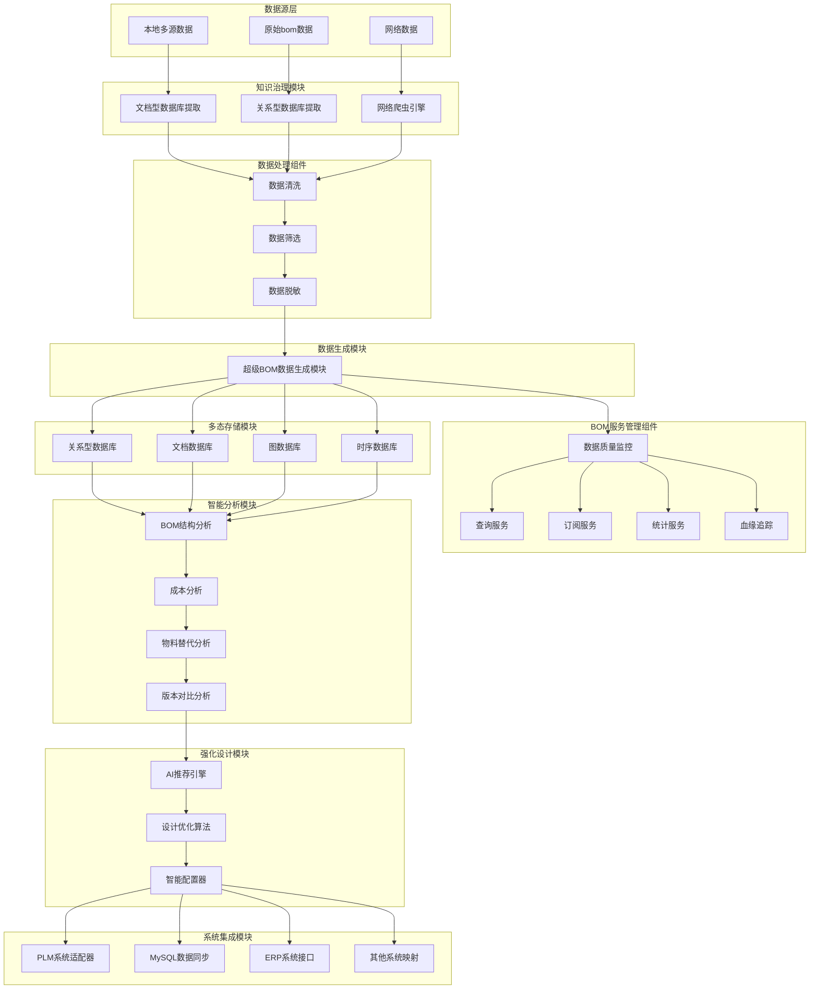
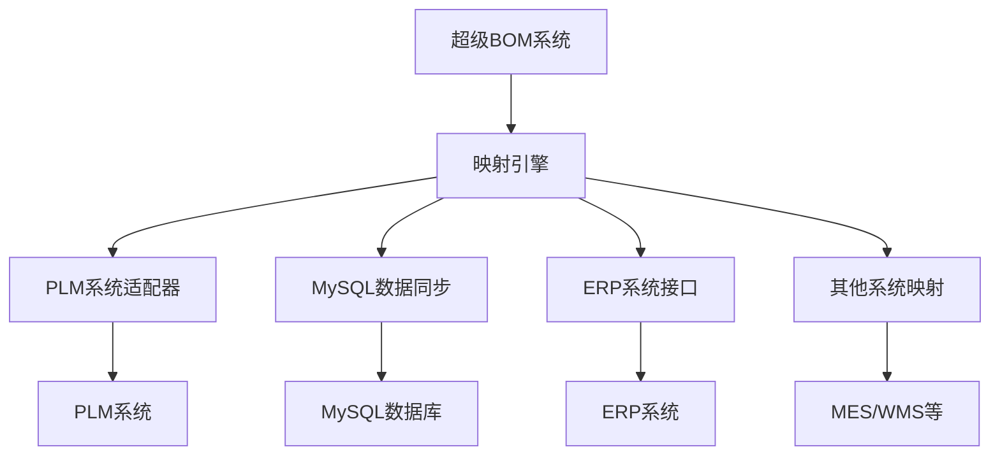
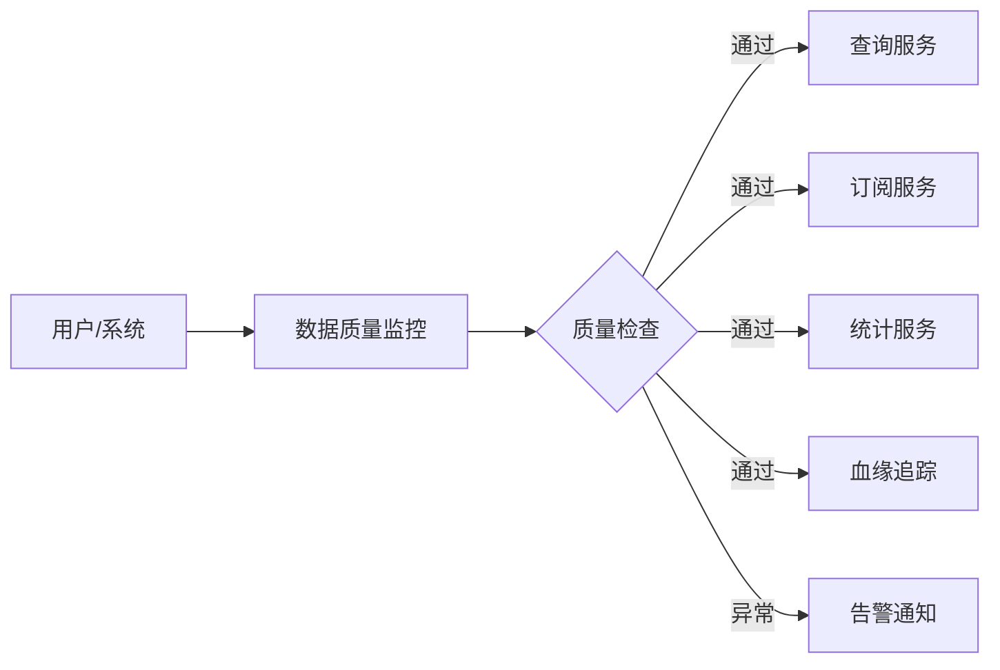
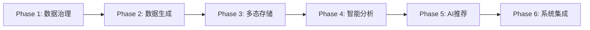

# 超级BOM系统流程分析

## 一、系统概述

超级BOM系统是一个智能化的物料清单管理系统,通过六大核心模块实现从数据采集到系统集成的全流程智能化管理。系统采用分层架构设计,具有数据治理、智能分析、AI推荐等核心能力。

---

## 二、系统架构图

### 2.1 整体架构流程



---

## 三、核心模块详细分析

### 3.1 知识治理模块 (数据收集与清洗)

**职责**: 从多源异构数据源中采集数据,并进行标准化处理

#### 3.1.1 数据采集组件

| 组件名称 | 数据源类型 | 主要功能 |
|---------|----------|---------|
| **文档型数据库提取** | MongoDB/ES等 | 提取非结构化BOM数据、设计文档、历史记录 |
| **关系型数据库提取** | Oracle/MySQL/SQL Server | 提取结构化的BOM主数据、物料信息 |
| **网络爬虫引擎** | 互联网公开数据 | 采集行业标准、供应商信息、市场数据 |

#### 3.1.2 数据清洗流程


**关键处理步骤**:
1. **数据清洗**: 去重、格式化、空值处理、异常值检测
2. **数据筛选**: 根据业务规则过滤无效数据、历史废弃数据
3. **数据脱敏**: 敏感信息加密、个人信息匿名化

---

### 3.2 数据生成模块

**职责**: 将清洗后的数据组装成新的超级BOM数据模型

#### 3.2.1 超级BOM数据模型特点

- **多维度建模**: 融合结构维度、成本维度、供应链维度
- **版本管理**: 支持BOM版本追溯与演进历史
- **关联关系**: 建立物料间的替代关系、配套关系
- **元数据丰富**: 包含设计参数、工艺参数、质量参数

#### 3.2.2 数据组装流程

```
原始BOM + 物料主数据 + 供应商数据 + 成本数据 
    ↓
关系映射与融合
    ↓
超级BOM数据模型
```

---

### 3.3 多态存储模块

**职责**: 根据数据特征动态选择存储方式,并自动调节权重

#### 3.3.1 多态存储策略

| 存储类型 | 适用场景 | 权重调节依据 |
|---------|---------|------------|
| **关系型数据库** | 结构化BOM主数据、事务处理 | 查询频率、事务一致性要求 |
| **文档数据库** | 半结构化设计文档、配置信息 | 文档复杂度、检索需求 |
| **图数据库** | BOM层级关系、物料关联网络 | 关系深度、图查询频率 |
| **时序数据库** | BOM变更历史、性能监控数据 | 时间跨度、查询模式 |

#### 3.3.2 动态权重调节机制

```python
# 权重调节伪代码
if 查询频率 > 阈值:
    提高热数据库权重(如Redis缓存)
if 数据关系复杂度 > 阈值:
    提高图数据库权重
if 历史追溯需求增加:
    提高时序数据库权重
```

---

### 3.4 智能分析模块

**职责**: 对BOM数据进行深度分析,并动态更新优化

#### 3.4.1 核心分析能力

| 分析维度 | 分析内容 | 输出结果 |
|---------|---------|---------|
| **BOM结构分析** | 层级深度、物料分布、复杂度评估 | 结构优化建议 |
| **成本分析** | 物料成本占比、成本驱动因素 | 降本机会点识别 |
| **物料替代分析** | 可替代物料推荐、风险评估 | 替代方案库 |
| **版本对比分析** | BOM版本差异、变更影响分析 | 变更影响报告 |

#### 3.4.2 数据更新机制

- **实时更新**: 基于数据质量监控的异常触发更新
- **周期更新**: 定期重新计算分析指标
- **事件驱动**: 新设计、物料变更触发重分析

---

### 3.5 强化设计模块

**职责**: 基于历史数据和AI算法智能推荐新型BOM设计

#### 3.5.1 AI推荐引擎

**技术栈**:
- 机器学习模型: 基于历史优秀设计案例训练
- 知识图谱: 物料-应用场景-性能参数关联网络
- 强化学习: 通过设计反馈持续优化推荐策略

**推荐流程**:


#### 3.5.2 智能推荐场景

1. **新产品设计**: 基于相似产品推荐BOM结构
2. **物料选型**: 推荐性价比最优的物料组合
3. **成本优化**: 在满足性能前提下推荐低成本方案
4. **供应链优化**: 考虑供应商稳定性的BOM推荐

---

### 3.6 系统集成模块

**职责**: 通过映射关系兼容现有系统,实现数据互通

#### 3.6.1 集成架构



#### 3.6.2 映射关系管理

| 目标系统 | 映射方式 | 同步策略 |
|---------|---------|---------|
| **PLM系统** | 字段级映射 + 业务规则转换 | 双向同步,以PLM为主 |
| **MySQL** | 数据模型转换 + SQL脚本 | 单向推送 |
| **ERP系统** | API接口调用 + 消息队列 | 准实时同步 |
| **其他系统** | 自定义适配器 + ETL工具 | 按需配置 |

#### 3.6.3 数据转换示例

```
超级BOM格式:
{
  "bom_id": "SB-001",
  "structure": {...},
  "cost_analysis": {...}
}

↓ 转换为ERP格式 ↓

ERP BOM格式:
{
  "material_number": "M-001",
  "bom_header": {...},
  "bom_items": [...]
}
```

---

## 四、BOM服务管理组件

### 4.1 核心服务能力

| 服务名称 | 功能描述 | 应用场景 |
|---------|---------|---------|
| **数据质量监控** | 实时监控数据完整性、准确性、一致性 | 数据治理、异常预警 |
| **查询服务** | 提供多维度BOM查询接口 | 前端展示、报表生成 |
| **订阅服务** | 支持BOM变更订阅通知 | 下游系统联动 |
| **统计服务** | BOM数据统计分析 | 管理决策支持 |
| **血缘追踪** | 追溯BOM数据来源与变更链路 | 审计、溯源 |

### 4.2 服务交互流程



---

## 五、系统关键技术点

### 5.1 数据治理

- **元数据管理**: 统一元数据标准,建立数据字典
- **数据质量规则**: 定义质量检查规则,自动化质量评估
- **主数据管理**: 建立物料主数据中心,保证数据一致性

### 5.2 智能算法

- **机器学习**: 用于物料推荐、成本预测
- **图算法**: 用于BOM结构分析、关联挖掘
- **NLP技术**: 用于设计文档解析、需求理解

### 5.3 性能优化

- **分布式存储**: 支持海量BOM数据存储
- **缓存机制**: 热点数据缓存,提升查询性能
- **异步处理**: 大批量数据处理采用异步任务队列

---

## 六、业务价值分析

### 6.1 核心价值

1. **数据统一**: 打破数据孤岛,建立统一BOM数据中心
2. **智能决策**: AI辅助设计,提升设计效率和质量
3. **成本优化**: 通过智能分析降低BOM成本
4. **系统集成**: 无缝对接现有系统,降低迁移成本

### 6.2 应用场景

- **研发设计**: 新产品BOM智能设计
- **成本管理**: BOM成本分析与优化
- **供应链管理**: 基于BOM的采购计划
- **生产制造**: BOM数据驱动的生产排程

---

## 七、系统实施建议

### 7.1 实施路径



### 7.2 关键成功因素

1. **数据质量**: 确保源数据的准确性和完整性
2. **算法优化**: 持续优化AI推荐算法
3. **用户培训**: 提升用户对新系统的接受度
4. **集成测试**: 充分测试与现有系统的兼容性

---

## 八、总结

超级BOM系统通过六大模块的协同工作,构建了一个从数据采集到智能应用的完整闭环:

1. **知识治理模块** 保证数据源头质量
2. **数据生成模块** 构建统一数据模型
3. **多态存储模块** 提供灵活高效的存储能力
4. **智能分析模块** 挖掘数据价值
5. **强化设计模块** 实现AI辅助设计
6. **系统集成模块** 确保业务连续性

系统的核心竞争力在于:
- ✅ **数据智能**: 基于AI的智能推荐与分析
- ✅ **架构灵活**: 多态存储适应不同场景
- ✅ **集成便捷**: 无缝对接现有系统
- ✅ **持续优化**: 强化学习机制不断提升系统能力

---

**文档版本**: v1.0  
**生成时间**: 2025-11-17  
**适用范围**: 超级BOM系统架构设计与分析
